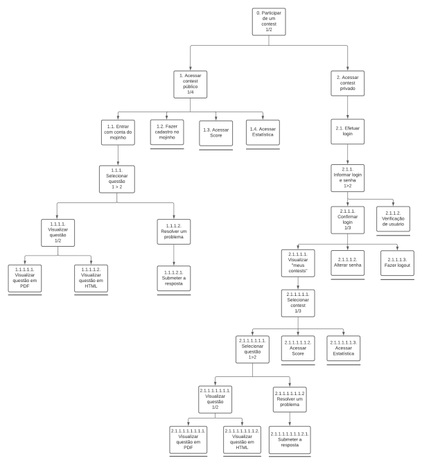
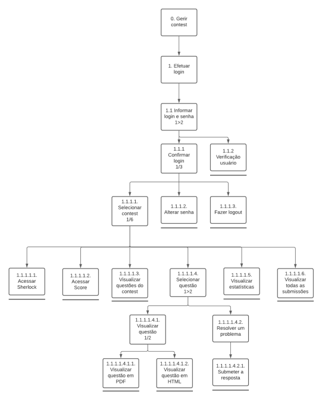

# Reestruturação de Tarefas

## 1. Introdução

Com base no ciclo de Mayhew (Barbosa e Silva, 2010), processo de design que estamos utilizando, estamos fazendo a reengenharia do trabalho e com isso reestruturando as tarefas para melhorar o desempenho e satisfação dos usuários. As tarefas do sistema foram analisadas e percebemos algumas falhas e problemas, e então propomos uma nova estrutura para corrigí-las.

## 2. Mudanças propostas

Em ambos os diagramas haviam pequenos problemas na estrutura e na notação utilizada. Todos esses problemas também foram resolvidos nos novos diagramas. Abaixo está separado os problemas específicos tanto para as tarefas dos alunos quanto dos professores.

## 2.1 Tarefas de aluno

**Problema:**

Foi apontado que o usuário, nesse caso aluno, precisa decorar um usuário e senha para cada contest que ele participa (até mesmo contents de uma mesma disciplina), gerando uma sobrecarga cognitiva, o que causa frustrações além da perda de desempenho.

**Solução:**

Para solucionar esse problema foi decidido que o usuário teria uma conta principal e essa conta pode ser associada a um contest por um professor, dessa forma o usuário precisa de apenas um único login e senha.

## 2.2 Tarefas de professor

**Problema:**

Foi apontado que o usuário, nesse caso professor, precisa decorar uma série de comandos para realizar funções básicas na lista de exercícios, como por exemplo, criar uma nova lista ou aumentar a data limite da mesma, gerando um trabalho adicional.

**Solução:**

Para solucionar esse problema foi decidido que a interface disponibilizará funcionalidades de gestão do contest para os usuários identificados como um professor, desta forma a simplicidade das tarefas se torna maior.

## 3. Diagramas refatorados

### 3.1 Diagrama HTA para realizar contest como aluno

<a class="link" href="https://drive.google.com/file/d/1GixWzuzq43S2DCKUsStYAkmyxxH06KAe/view?usp=sharing" target="_blank">Link para o diagrama acima</a>

### 3.2 Representação de Tarefas para o objetivo de realizar contest como aluno

|Objetivo/Operações|Problemas e Recomendações|
|-|-|
| 0. Participar de um *contest* 1/2 | **ação**: Participar de um *constest*   **plano**: Participar de um *contest* e resolver os problemas |
| 1. Acessar *contest* publico 1/4 | **ação**: Clicar no *contest* desejado   **plano**: Acessar o *contest* desejado |
| 1.1. Fazer cadastro no mojinho | **ação**: Fazer cadastro do usuário por meio do chatbot mojinho |
| 1.1.1. Selecionar questão 1>2 | **plano**: Escolher uma questão para resolver ou visualizar |
| 1.1.1.1. Visualizar questão 1/2 | **plano**: Visualizar uma questão |
| 1.1.1.1.1. Visualizar questão em PDF | **ação**: Abrir descrição da questão em um documento PDF |
| 1.1.1.1.2. Visualizar questão em HTML | **ação**: Abrir descrição da questão em um documento HTML |
| 1.1.1.2. Resolver um problema | **ação**: Pensar numa solução para o problema  |
| 1.1.1.2.1 Submeter a resposta | **input**: Arquivo contendo um código fonte |
| 1.2. Fazer cadastro no mojinho | **ação**: Fazer cadastro do usuário por meio do chatbot mojinho |
| 1.3. Acessar *Score* | **plano**: Visualizar quais questões os participantes já enviaram e/ou acertaram|
| 1.4 Acessar estatística | **plano**: Visualizar os dados estatísticos acerca das questões   **feedback**: O sistema informará se a estatística está disponivel |
| 2. Acessar contest privado | **plano**: Acessar o contest desejado |
| 2.1. Efetuar *Login* | **plano**: Visualizar questões do *contest* |
| 2.1.1. Informar *login* e senha 1>2 | **input**: Fornecer *login* e senha |
| 2.1.1.1. Confirmar *login* 1/3 | **ação**: Clicar no botão de *login* |
| 2.1.1.1.1. Visualizar meu *contest* | **plano**: Visualizar questões do *contest* |
| 2.1.1.1.1.1. Selecionar contest 1/3 | **plano**: Escolher uma questão para resolver ou visualizar |
| 2.1.1.1.1.1.1. Selecionar questão 1>2 | **plano**: Escolher uma questão para resolver ou visualizar |
| 2.1.1.1.1.1.1.1. Visualizar questão 1/2 | **plano**: Visualizar uma questão |
| 2.1.1.1.1.1.1.1.1. Visualizar questão em PDF | **ação**: Abrir descrição da questão em um documento PDF |
| 2.1.1.1.1.1.1.1.2. Visualizar questão em HTML | **ação**: Abrir descrição da questão em um documento HTML |
| 2.1.1.1.1.1.1.2. Resolver um problema | **ação**: Pensar numa solução para o problema  |
| 2.1.1.1.1.1.1.2.1. Submeter a resposta | **input**: Arquivo contendo um código fonte |
| 2.1.1.1.1.1.2. Acessar *score* | **plano**: Visualizar quais questões os participantes já enviaram e/ou acertaram|
| 2.1.1.1.1.1.3. Acessar estatística | **plano**: Visualizar os dados estatísticos acerca das questões   **feedback**: O sistema informará se a estatística está disponivel |
| 2.1.1.1.2. Alterar senha | **feedback**: O sistema informará se é possível alterar a senha   **input**: A nova senha   **ação**: Clicar no botão de mudar a senha |
| 2.1.1.1.3. Fazer *logout* | **ação**: Sair do *contest* atual |
| 2.1.1.2. Verificação usuário| **feedback**: O sistema informa se a senha está incorreta |

### 3.3 Diagrama HTA para gerenciar contest como professor

<a class="link" href="https://drive.google.com/file/d/19_fjn6yyXVgGXkTpxIu4G_MwEItJ054D/view?usp=sharing" target="_blank">Link para o diagrama acima</a>

### 3.4 Representação de Tarefas para o objetivo de gerenciar contest como professor

|Objetivo/Operações|Problemas e Recomendações|
|-|-|
| 0. Efetuar *login*| **plano**: Efetuar *login* e senha |
| 1. Informar *login* e senha| **input**: Fornecer *login* e senha |
| 2. Confirmar *login* 1/8 |  **ação**: Clicar no botão de *login* |
| 2.1. Acessar *Sherlock* | **plano**: Descobrir as submissões suspeitas de plágio   **feedback**:  O sistema informa os códigos que suspeitos de plágio |
| 2.2. Acessar *Score* | **plano**: Mostrar quais questões foram enviadas pelos participantes do *contest* |
| 2.3. Visualizar questões do *contest* | **plano**: Visualizar as questões do *contest* |
| 2.4. Alterar Senha | **feedback**: O sistema informará se é possível alterar a senha.   **problema**: O sistema não permite que a senha seja alterada.|
| 2.5. Fazer *logout* | **ação**: Sair do *contest* atual |
| 2.6. Selecionar questão 1/3 | **plano**: Selecionar uma questão para resolver |
| 2.6.1. Resolver um problema | **ação**: Criar uma solução para o problema proposto |
| 2.6.1.1. Submeter a resposta | **ação**: Clicar no *select* para escolher a questão e submeter o *script*/código com a possível solução da questão |
| 2.6.2. Visualizar questão em PDF | **ação**: Mostrar questão em formato *PDF*.|
| 2.6.3 Visualizar questão em HTML | **ação**: Mostrar questão em formato *HTML*. |
| 2.7. Visualizar estatísticas | **plano**: Visualizar os dados estatísticos acerca das questões   **feedback**: O sistema informará se a estatística está disponivel |
| 2.8. Visualizar todas as submissões | **ação**: Mostrar todos os exercícios enviados por cada aluno. |

## 4. Referências Bibliográficas

- BARBOSA, Simone; SILVA, Bruno. "Interação Humano-Computador". Elsevier Editora Ltda, 2010.
- DIAPER, Dan; STANTON, Neville. "The handbook of task analysis for human-computer interaction". Mahwah, NJ: Lawrence Erlbaum Associates, 2004.

## Versionamento
| Versão | Data | Modificação | Autor |
|--|--|--|--|
| 1.0 | 21/10/2020 | Criação documento | Todos os integrantes |
| 1.1 | 05/11/2020 | Correção nas mudanças propostas | Igor Paiva |
