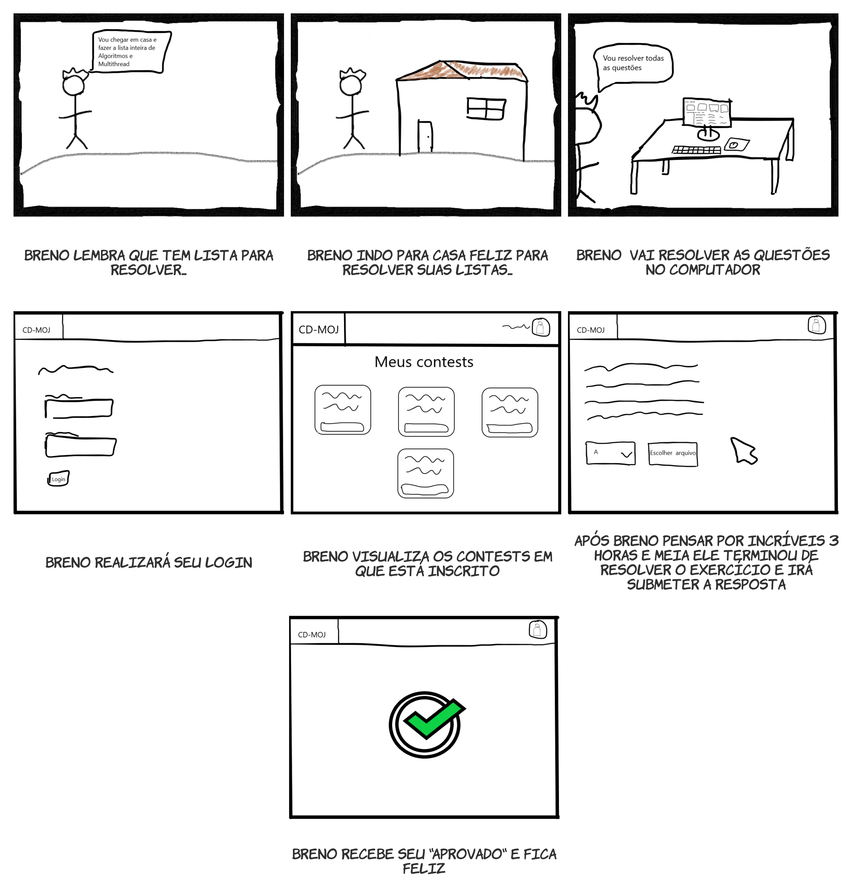
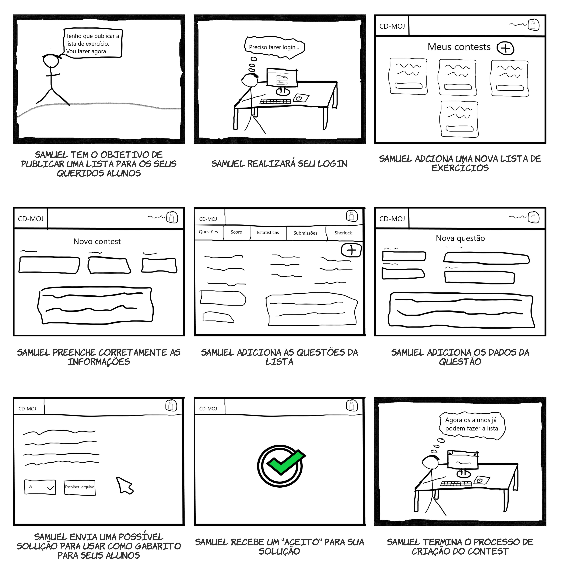

# Protótipo de baixa fidelidade - Storyboard

## 1. Introdução

Um protótipo de baixa fidelidade não parece muito com o produto final, e também não provê a mesma funcionalidade. Pode utilizar diferentes materiais, como papel e cartolina em vez de telas eletrônicas ou metal, ele pode executar apenas um conjunto limitado de funções, ou pode apenas representar as funções e não executar nenhuma delas (Sharp, Rogers e Preece, 2019).

## 2. Storyboards

<i>Storyboard</i> é um exemplo de protótipo de baixa fidelidade, normalmente é realizado em conjunto com cenários. Um storyboard consiste em uma série de <i>sketches</i> (esboços) ou uma série de cenas mostrando como um usuário pode executar uma tarefa com um dispositivo interativo. Quando realizado em conjunto com cenários ele provê mais detalhes aos <i>stakeholders</i> e possibilita a interpretação (<i>role-play</i>) com o protótipo, interagindo com ele ao passar pelos cenários (Sharp, Rogers e Preece, 2019).

### 2.1 Aluno

#### 2.1.1 Submissão aceita

<a class="link" href="https://drive.google.com/file/d/1wnP-v-mSOmeXeyJbZhImUvTzWXpT5VNP/view?usp=sharing" target="_blank">link para o storyboard acima</a>

#### 2.1.2 Submissão recusada

<a class="link" href="https://drive.google.com/file/d/11AemMwuGuAVBL1u74Ht4jPxaZ8We9vMu/view?usp=sharing" target="_blank">link para o storyboard acima</a>

#### 2.1.3 Visualizar Scoreboard

<a class="link" href="https://drive.google.com/file/d/1IYJZ7m4bZX8-h2e8pe7f_AooZ1fE0uXd/view?usp=sharing" target="_blank">link para o storyboard acima</a>

### 2.2 Professor

#### 2.2.1 Submeter contest

<a class="link" href="https://drive.google.com/file/d/11utIyszDhuTjtGKHSG6Ft1y3Bo4AdbCe/view?usp=sharing" target="_blank">link para o storyboard acima</a>

#### 2.2.2 Visualizar Estatísticas

<a class="link" href="https://drive.google.com/file/d/1cNVW1xLs3nuJF6xv3726_2o2ISaBV2bL/view?usp=sharing" target="_blank">link para o storyboard acima</a>

#### 2.2.3 Visualizar Submissões

<a class="link" href="https://drive.google.com/file/d/1-AGEElcrLXQBObQ_M401fNCvM7g5oKl8/view?usp=sharing" target="_blank">link para o storyboard acima</a>

#### 2.2.4 Visualizar Scoreboard

<a class="link" href="https://drive.google.com/file/d/1gr9Skvtrm_aJbqf2hyRthv8jxV6XCR9Y/view?usp=sharing" target="_blank">link para o storyboard acima</a>

#### 2.2.5 Visualizar Sherlock

<a class="link" href="https://drive.google.com/file/d/17NEmqTsFrb9IxVTSUAp7cRJnekyXJAdD/view?usp=sharing" target="_blank">link para o storyboard acima</a>

## 3. Referências Bibliográficas

- SHARP, Helen; ROGERS, Yvonne; PREECE, Jenny. "INTERACTION DESIGN beyond human-computer interaction". John Wiley & Sons, 2019.

## Versionamento
| Versão | Data | Modificação | Autor |
|--|--|--|--|
| 1.0 | 27/10/2020 | Criação do documento | Todos os integrantes |
