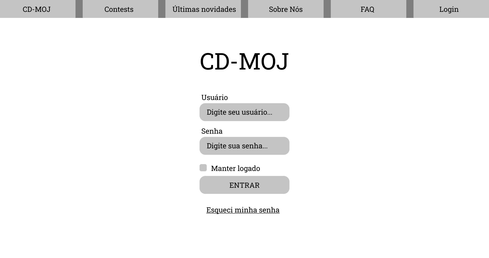
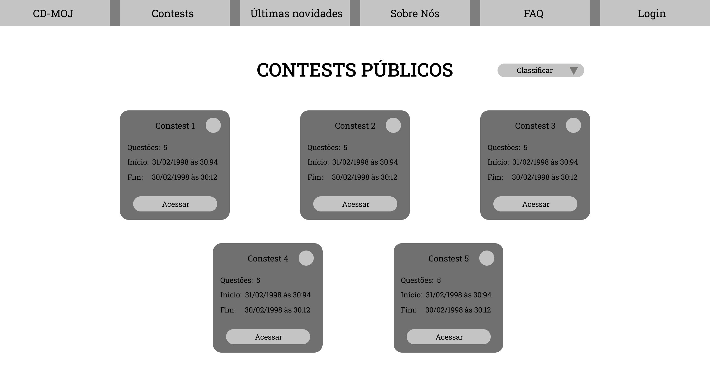
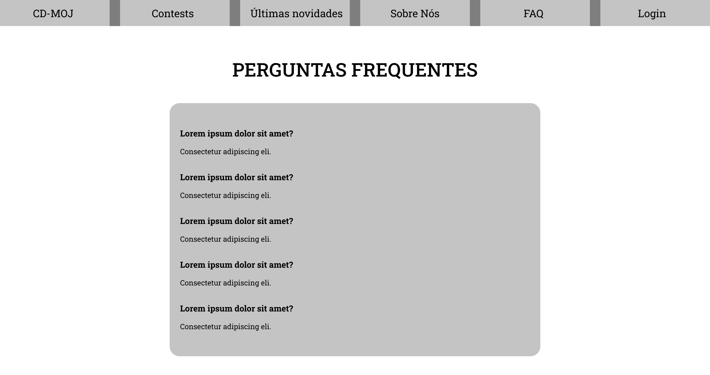
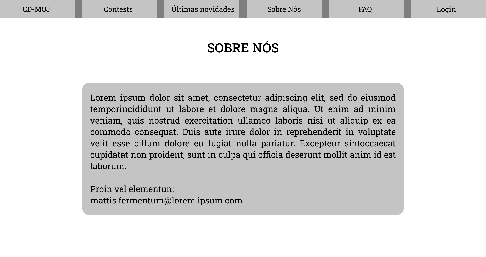
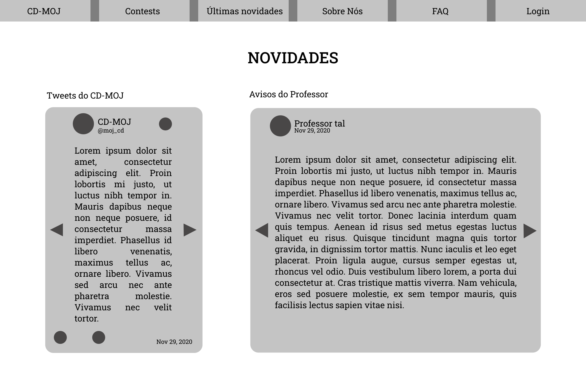
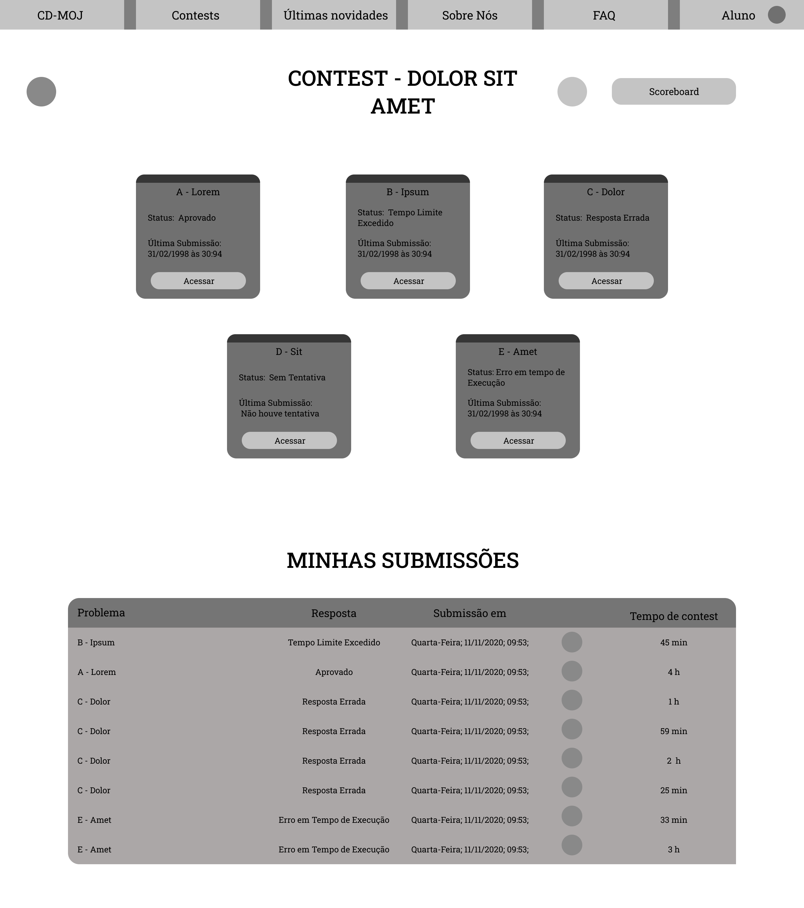
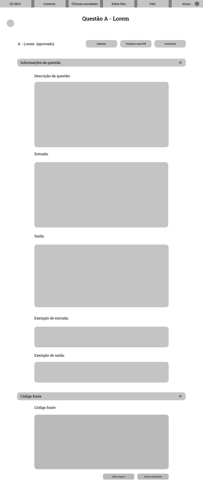
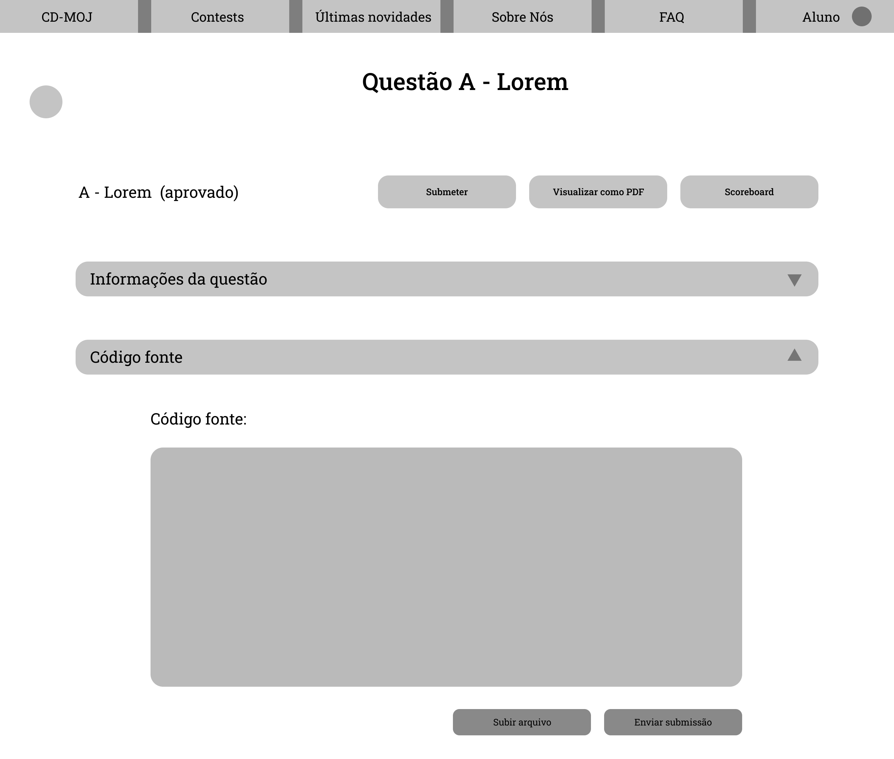
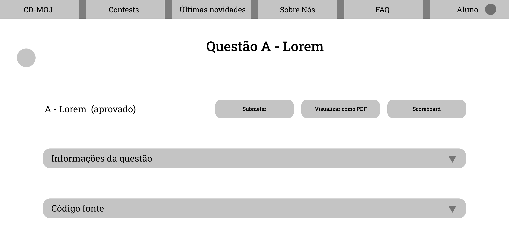
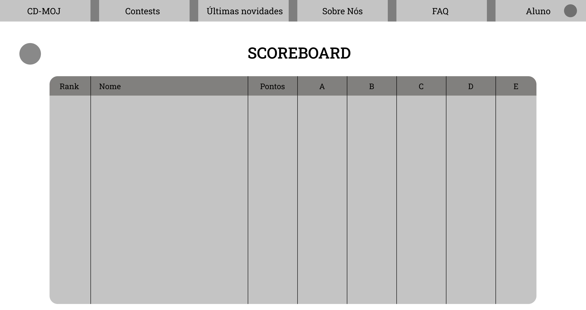

# Protótipo média fidelidade

## Protótipo

O protótipo pode ser encontrado <a class="link" href="https://www.figma.com/file/dV7wyqdNy6V8wgjO28BkbJ/Prot%C3%B3tipo-CD-MOJ-M%C3%A9dia?node-id=0%3A1" target="_blank">aqui</a>. E pode ser navegado abaixo:

<iframe style="border: 1px solid rgba(0, 0, 0, 0.1);" width="800" height="450" src="https://www.figma.com/embed?embed_host=share&url=https%3A%2F%2Fwww.figma.com%2Ffile%2FdV7wyqdNy6V8wgjO28BkbJ%2FProt%25C3%25B3tipo-CD-MOJ-M%25C3%25A9dia%3Fnode-id%3D0%253A1" allowfullscreen></iframe>

## Home

<a class="link" href="https://drive.google.com/file/d/1VVt7PFKCcFCOoNZm9FY69SGZXzigP3Ep/view?usp=sharing" target="_blank">link para a imagem acima</a>

## Contests

<a class="link" href="https://drive.google.com/file/d/16eopdsqeB7f1LHVgWAZd3gqU06iRS1cP/view?usp=sharing" target="_blank">link para a imagem acima</a>

## FAQ

<a class="link" href="https://drive.google.com/file/d/1gltuN7N1iF99nEu_3yn6tVOzQ6oE81W5/view?usp=sharing" target="_blank">link para a imagem acima</a>

## Sobre nós

<a class="link" href="https://drive.google.com/file/d/1N5szJOjMPayc2tORfThgWa2wGQLoe-dU/view?usp=sharing" target="_blank">link para a imagem acima</a>

## Últimas novidades

<a class="link" href="https://drive.google.com/file/d/15oYbuG9x9bfHgM_zPvOGGkN8CM6hQ6Ar/view?usp=sharing" target="_blank">link para a imagem acima</a>

## Dentro do contest

<a class="link" href="https://drive.google.com/file/d/1NyqgV-FZ09dJIkvGuz1v9JZGp40AnyiB/view?usp=sharing" target="_blank">link para a imagem acima</a>

## Questão padrão

<a class="link" href="https://drive.google.com/file/d/183ONnJul8HipVM5I9c32hJHt4ImPrYok/view?usp=sharing" target="_blank">link para a imagem acima</a>

## Questão com as informações ocultadas

<a class="link" href="https://drive.google.com/file/d/1GT25LfFcf2tz9rNisYUIi-P7sLIhXT0j/view?usp=sharing" target="_blank">link para a imagem acima</a>

## Questão com as informações e código fonte ocultado

<a class="link" href="https://drive.google.com/file/d/16t_s054_VtLXhVBDTbP5a-U4wXUCqp8D/view?usp=sharing" target="_blank">link para a imagem acima</a>

## Scoreboard

<a class="link" href="https://drive.google.com/file/d/13P7cEEp8KqjKgnpTBOuuJhMGlOwgNcdC/view?usp=sharing" target="_blank">link para a imagem acima</a>

## Referências

- SHARP, Helen; ROGERS, Yvonne; PREECE, Jenny. "INTERACTION DESIGN beyond human-computer interaction". John Wiley & Sons, 2019.

## Versionamento
| Versão | Data | Modificação | Autor |
|--|--|--|--|
| 1.0 | 11/11/2020 | Criação do documento | Todos os integrantes |
