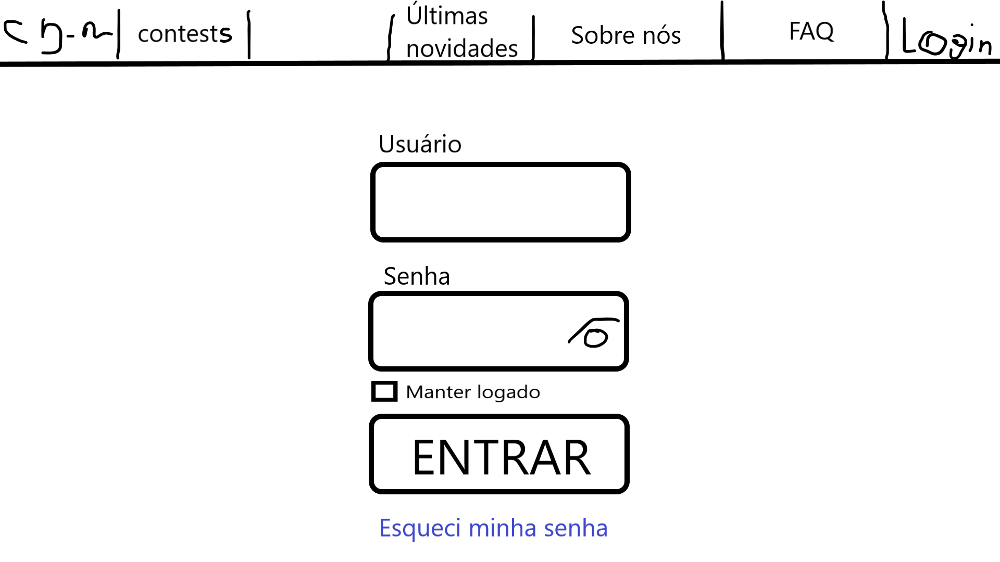
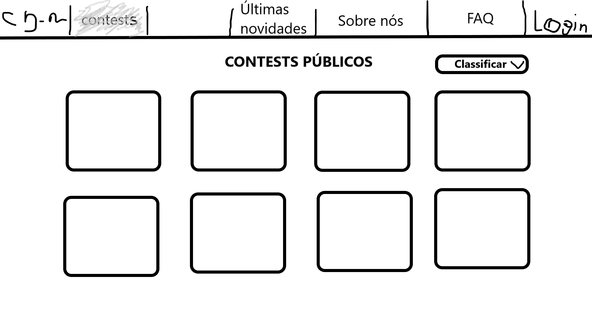
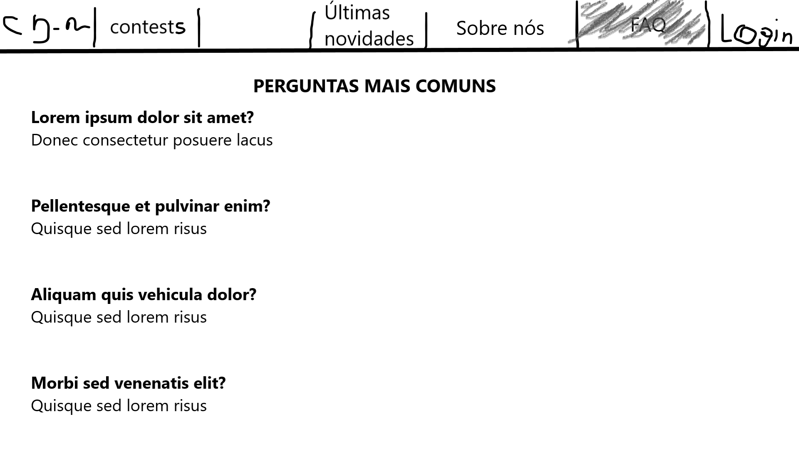
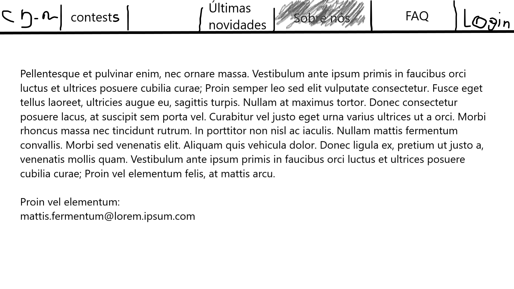
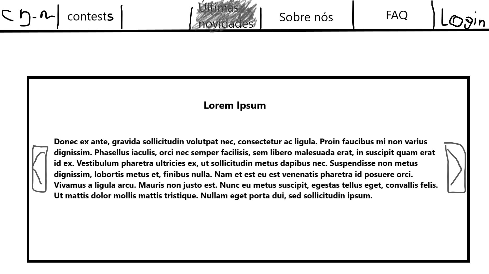
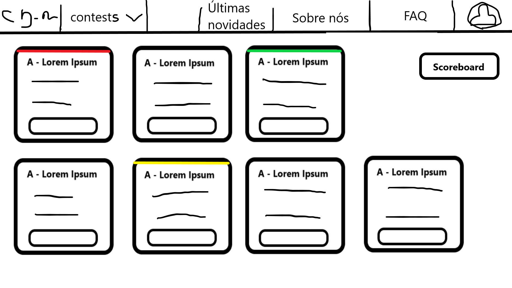
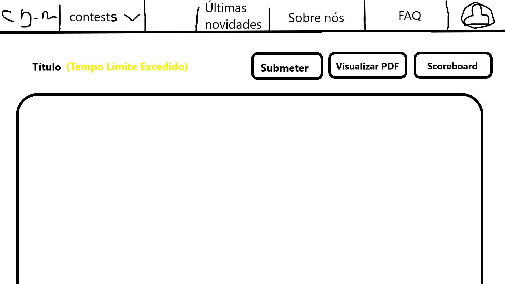
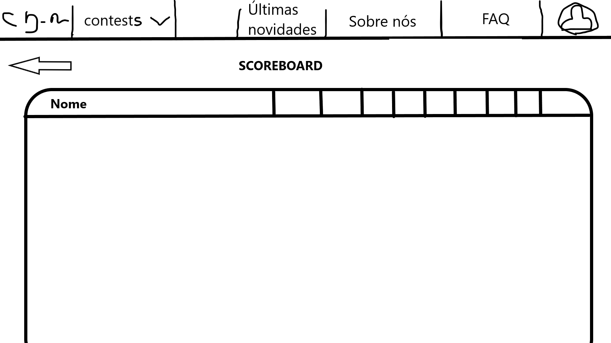
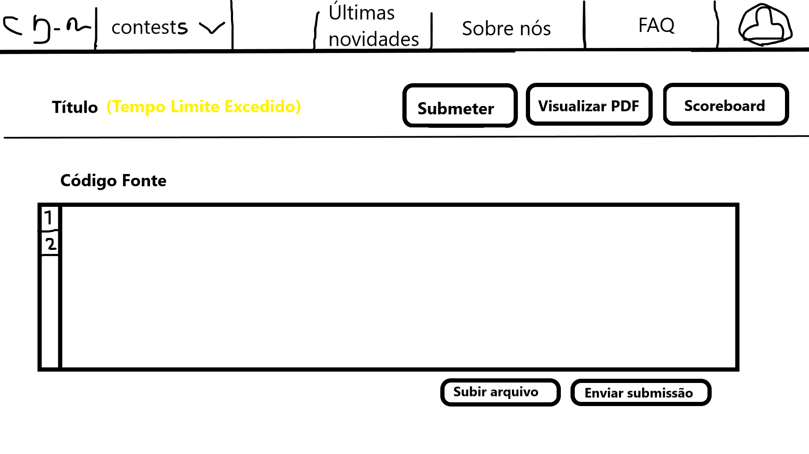

# Protótipo baixa fidelidade - Sketch

## Introdução

Para um entendimento básico sobre a estrutura da interface do usuário, foram criados sketches que serão utilizados para a criação do protótipo de média.

## Home

<a class="link" href="https://drive.google.com/file/d/149UDhfQJnqlH8EftY19eA05lLSeCYXj1/view?usp=sharing" target="_blank">link para o sketch acima</a>

## Contests

<a class="link" href="https://drive.google.com/file/d/1Mo3gM_Wh_2rE_KMNSLyBPfRVLcyaDDIv/view?usp=sharing" target="_blank">link para o sketch acima</a>

## FAQ

<a class="link" href="https://drive.google.com/file/d/1Yy68Ff8YT8uHzCLqErtiQ-dNSyod-YdD/view?usp=sharing" target="_blank">link para o sketch acima</a>

## Sobre nós

<a class="link" href="https://drive.google.com/file/d/1nYJPERRvHKOPpy7Zl_Dclq6ACVzzioF3/view?usp=sharing" target="_blank">link para o sketch acima</a>

## Últimas novidades

<a class="link" href="https://drive.google.com/file/d/19D3XlGbH4eM2zFTf7n8aANt5q5D_E6tA/view?usp=sharing" target="_blank">link para o sketch acima</a>

## Dentro do contest

<a class="link" href="https://drive.google.com/file/d/10050cYALDhCMievaZn25HlROKlrz_o7m/view?usp=sharing" target="_blank">link para o sketch acima</a>

## Questão

<a class="link" href="https://drive.google.com/file/d/1E--DzrYu8onRYPHzFO2sC_rXKt-bCGLN/view?usp=sharing" target="_blank">link para o sketch acima</a>

## Scoreboard

<a class="link" href="https://drive.google.com/file/d/1k0RHMqXRhxUraRh1Cj5wSaeB4mH3yz9x/view?usp=sharing" target="_blank">link para o sketch acima</a>

## Submeter questão

<a class="link" href="https://drive.google.com/file/d/146hB4LZrwxFtkPb9OgPAytOD4HT0lX5g/view?usp=sharing" target="_blank">link para o sketch acima</a>

## Referências

- BARBOSA, Simone; SILVA, Bruno. "Interação Humano-Computador". Elsevier Editora Ltda, 2010.

## Versionamento
| Versão | Data | Modificação | Autor |
|--|--|--|--|
| 1.0 | 11/11/2020 | Criação do documento | Todos os integrantes |
