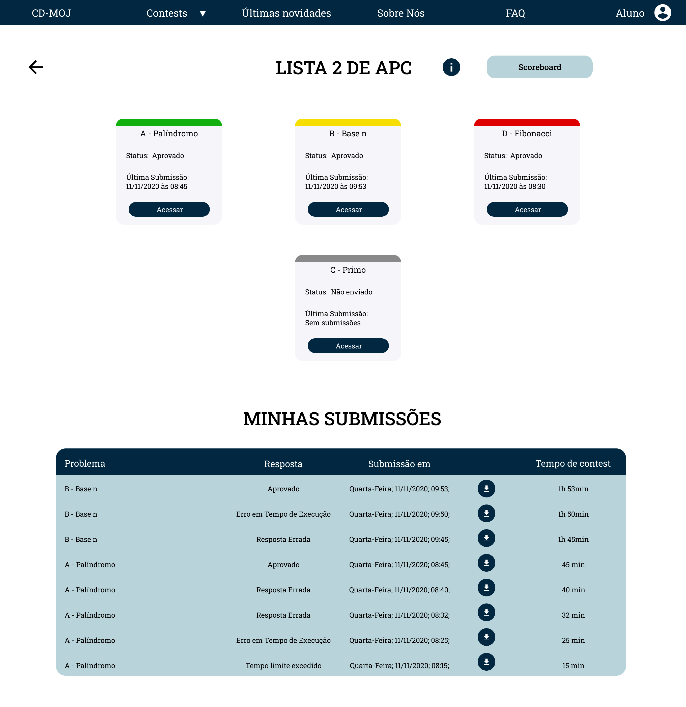
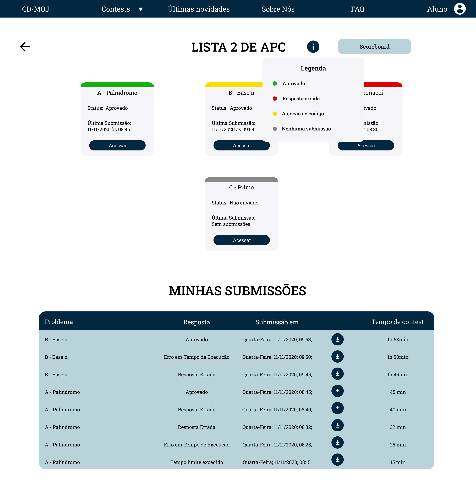
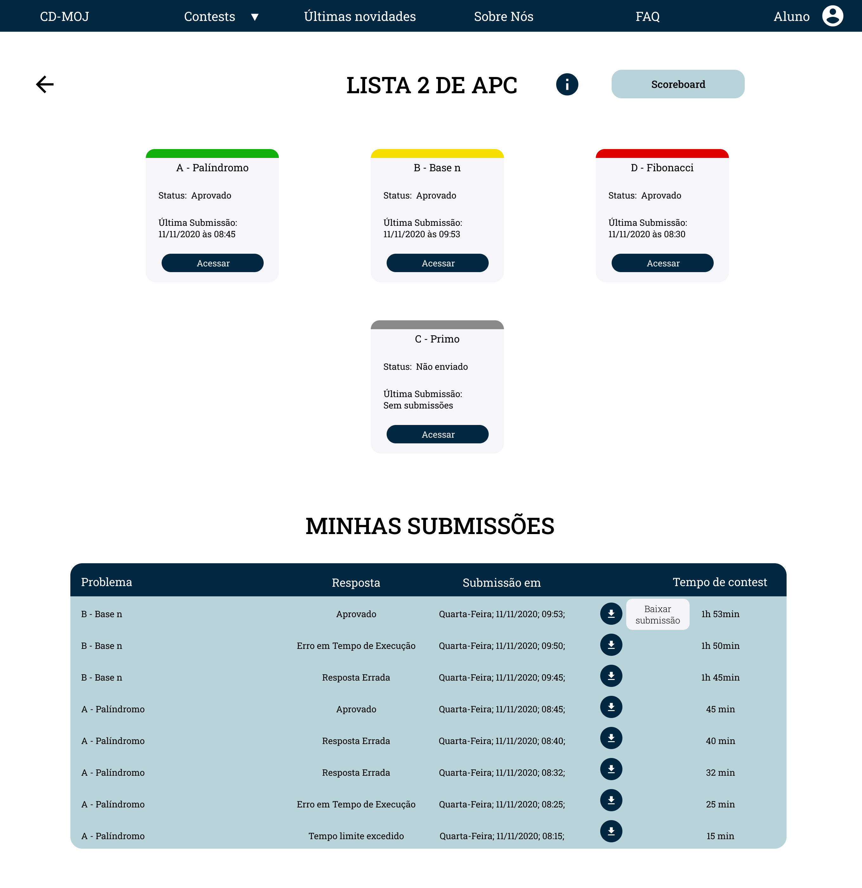
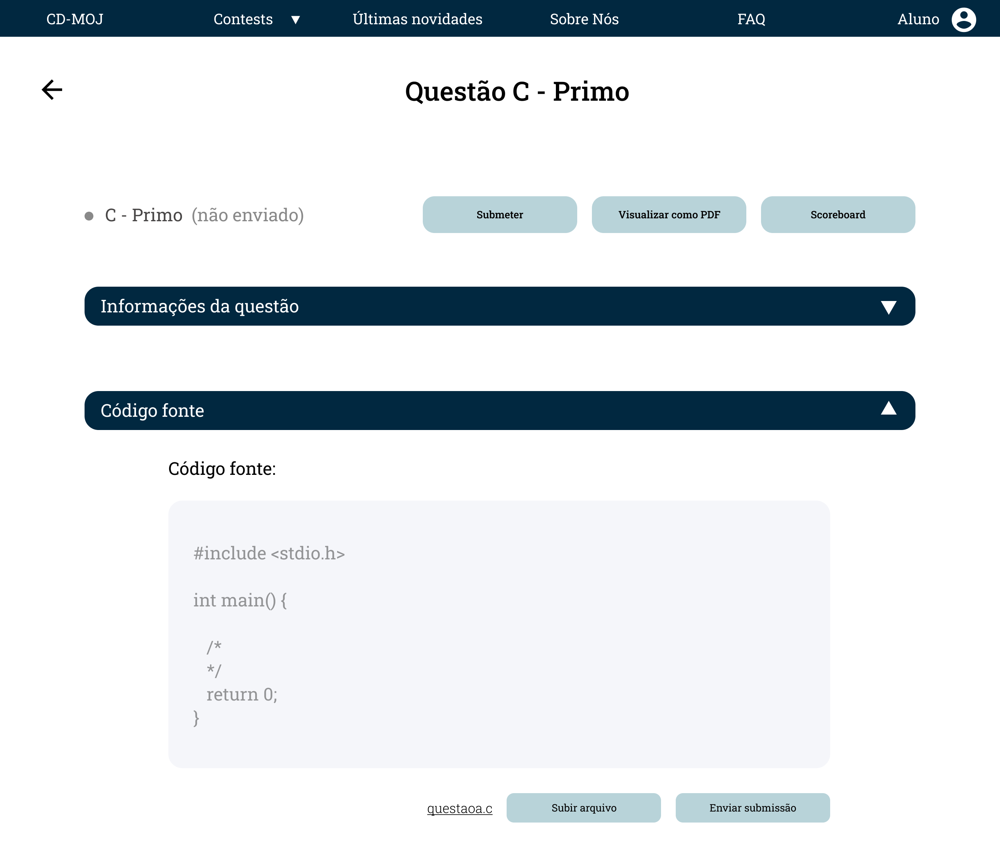

# Protótipo alta fidelidade

## Introdução

O protótipo foi produzido utilizando o <a class="link" href="https://www.figma.com/" target="_blank">Figma</a>, e o projeto pode ser acessado <a class="link" href="https://www.figma.com/file/6e0a2PDQNIVhWLBW5MiX7j/Prot%C3%B3tipo-CD-MOJ-Alta?node-id=0%3A1" target="_blank">aqui</a>. E o protótipo interativo pode ser encontrado <a class="link" href="https://www.figma.com/proto/6e0a2PDQNIVhWLBW5MiX7j/Prot%C3%B3tipo-CD-MOJ-Alta?node-id=5%3A7&scaling=min-zoom" target="_blank">aqui</a>.

## 1ª versão Protótipo Interativo

<iframe style="border: 1px solid rgba(0, 0, 0, 0.1);" width="800" height="450" src="https://www.figma.com/embed?embed_host=share&url=https%3A%2F%2Fwww.figma.com%2Ffile%2F6e0a2PDQNIVhWLBW5MiX7j%2FProt%25C3%25B3tipo-CD-MOJ-Alta%3Fnode-id%3D0%253A1" allowfullscreen></iframe>

## 2ª versão Protótipo Interativo

<iframe style="border: 1px solid rgba(0, 0, 0, 0.1);" width="800" height="450" src="https://www.figma.com/embed?embed_host=share&url=https%3A%2F%2Fwww.figma.com%2Fproto%2FjiWdgzEdwwe4FTAqAcKAeR%2FProt%25C3%25B3tipo-CD-MOJ-Alta-Teste%3Fnode-id%3D5%253A7%26scaling%3Dmin-zoom" allowfullscreen></iframe>

## Telas

### Home

<a class="link" href="https://drive.google.com/file/d/12JMH0qjJN3mj0-9v8TU3wt1XH2RcSsVL/view?usp=sharing" target="_blank">link para a imagem acima</a>

### Home classificar aberto

<a class="link" href="https://drive.google.com/file/d/1tf5YZVHF4DEkwMy62WzVB0XitmBkgVzC/view?usp=sharing" target="_blank">link para a imagem acima</a>

### FAQ

<a class="link" href="https://drive.google.com/file/d/1Q9me0v9UOtdTKpzFzUnaQmOMVi5463vU/view?usp=sharing" target="_blank">link para a imagem acima</a>

### Sobre nós

<a class="link" href="https://drive.google.com/file/d/1eFJzj9q2bEm4qqkMVn95raI3oe9lZLe9/view?usp=sharing" target="_blank">link para a imagem acima</a>

### Últimas novidades

<a class="link" href="https://drive.google.com/file/d/1MUqnsrzvmTZ51GuhthoIHMMviJhfBvQA/view?usp=sharing" target="_blank">link para a imagem acima</a>

### Login

<a class="link" href="https://drive.google.com/file/d/1EifcWIgJ3qm43Qpzg2Pely7rIkN6wHhG/view?usp=sharing" target="_blank">link para a imagem acima</a>

### Contests logado

<a class="link" href="https://drive.google.com/file/d/1OMLH-wLAgP5m6XEMZXt0K-KG6Gm8trsy/view?usp=sharing" target="_blank">link para a imagem acima</a>

### Contests logado com dropdown

<a class="link" href="https://drive.google.com/file/d/1kFa_Xve9aQuS6tYMxIcpTlsI-_ski5tt/view?usp=sharing" target="_blank">link para a imagem acima</a>

### Dentro do contest

<a class="link" href="https://drive.google.com/file/d/114AQCeCRRxZK7AZt5qZ96tp4wYrtihrn/view?usp=sharing" target="_blank">link para a imagem acima</a>

### Dentro do contest com legenda

<a class="link" href="https://drive.google.com/file/d/10M8lpbbxtgfdRW8wSJtxGFgJ98eVKjpE/view?usp=sharing" target="_blank">link para a imagem acima</a>

### Dentro do contest com tooltip de baixar submissão

<a class="link" href="https://drive.google.com/file/d/1qDfF6SXqmouj_kv6N94beYw-cIKcv0OM/view?usp=sharing" target="_blank">link para a imagem acima</a>

### Scoreboard

<a class="link" href="https://drive.google.com/file/d/1Wz2a6ahAQKFxpD4a5atAN1Qy2kFB5qry/view?usp=sharing" target="_blank">link para a imagem acima</a>

### Scoreboard com tooltip de legenda

<a class="link" href="https://drive.google.com/file/d/1Wmik-nK3E-A2pyWFq70-9xK8uj3lDGy7/view?usp=sharing" target="_blank">link para a imagem acima</a>

### Questão padrão

<a class="link" href="https://drive.google.com/file/d/1AUamzVdOZk2nErmaD9pWoEcSLNnE3tcy/view?usp=sharing" target="_blank">link para a imagem acima</a>

### Questão com modal de sucesso

<a class="link" href="https://drive.google.com/file/d/1QpJOAjJoqRon_P5pWkFU-QvdhYMIIkpV/view?usp=sharing" target="_blank">link para a imagem acima</a>

### Questão com as informações ocultadas

<a class="link" href="https://drive.google.com/file/d/16MkvROgTTOqWuDKvOi4V1ZhHM33RO8Ml/view?usp=sharing" target="_blank">link para a imagem acima</a>

### Questão com o código fonte ocultado

<a class="link" href="https://drive.google.com/file/d/1PDRh9s4ch__Pjt9cbc2bKUziNHsN7SeP/view?usp=sharing" target="_blank">link para a imagem acima</a>

### Questão com as informações e código fonte ocultado

<a class="link" href="https://drive.google.com/file/d/1POTRbf_FMaNBcPAdldCOcUYf68cXQd-8/view?usp=sharing" target="_blank">link para a imagem acima</a>

## Referências

- SHARP, Helen; ROGERS, Yvonne; PREECE, Jenny. "INTERACTION DESIGN beyond human-computer interaction". John Wiley & Sons, 2019.

## Versionamento
| Versão | Data | Modificação | Autor |
|--|--|--|--|
| 1.0 | 17/11/2020 | Criação do documento | Todos os integrantes |
| 2.0 | 24/11/2020 | Adição protótipo melhorado | Todos os integrantes |
