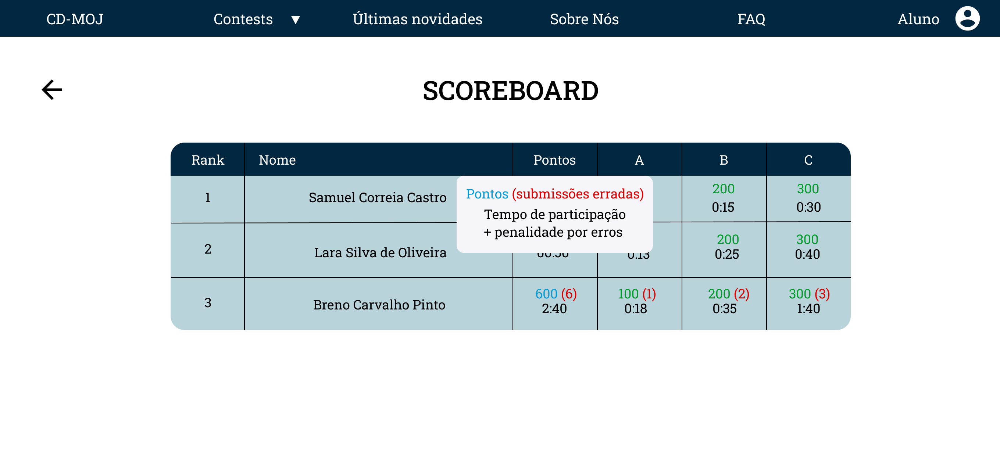
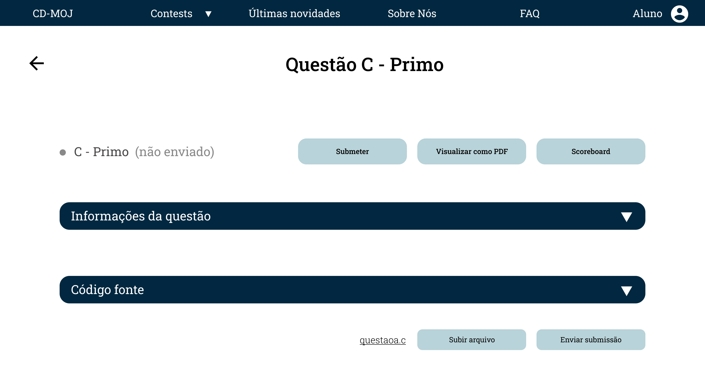

# Protótipo alta fidelidade

## Introdução

O protótipo foi produzido utilizando o <a class="link" href="https://www.figma.com/" target="_blank">Figma</a>, e o projeto pode ser acessado <a class="link" href="https://www.figma.com/file/6e0a2PDQNIVhWLBW5MiX7j/Prot%C3%B3tipo-CD-MOJ-Alta?node-id=0%3A1" target="_blank">aqui</a>. E o protótipo interativo pode ser encontrado <a class="link" href="https://www.figma.com/proto/6e0a2PDQNIVhWLBW5MiX7j/Prot%C3%B3tipo-CD-MOJ-Alta?node-id=5%3A7&scaling=min-zoom" target="_blank">aqui</a>.

## 1ª versão Protótipo Interativo

<iframe style="border: 1px solid rgba(0, 0, 0, 0.1);" width="800" height="450" src="https://www.figma.com/embed?embed_host=share&url=https%3A%2F%2Fwww.figma.com%2Fproto%2F6e0a2PDQNIVhWLBW5MiX7j%2FProt%25C3%25B3tipo-CD-MOJ-Alta-1a-vers%25C3%25A3o%3Fnode-id%3D5%253A7%26scaling%3Dmin-zoom" allowfullscreen></iframe>

## 2ª versão Protótipo Interativo

<iframe style="border: 1px solid rgba(0, 0, 0, 0.1);" width="800" height="450" src="https://www.figma.com/embed?embed_host=share&url=https%3A%2F%2Fwww.figma.com%2Fproto%2FjiWdgzEdwwe4FTAqAcKAeR%2FProt%25C3%25B3tipo-CD-MOJ-Alta-Teste%3Fnode-id%3D5%253A7%26scaling%3Dmin-zoom" allowfullscreen></iframe>

## Home

.png)

<a class="link" href="https://drive.google.com/file/d/1n7iQ0bHLwrrQQDnEX_U4ixDxhtNZqlNW/view?usp=sharing" target="_blank">link para a imagem acima</a>

## Home classificar aberto

<a class="link" href="https://drive.google.com/file/d/1VbsddYWnqNqc3bWiJC53j9k-ALY0kaIa/view?usp=sharing" target="_blank">link para a imagem acima</a>

## FAQ

<a class="link" href="https://drive.google.com/file/d/13qB_A3Naqe45cum_m_M5NEn6xacqleQN/view?usp=sharing" target="_blank">link para a imagem acima</a>

## Sobre nós

<a class="link" href="https://drive.google.com/file/d/1PA9syR-s3iRZaObtMQ0uUghuhsLNogfi/view?usp=sharing" target="_blank">link para a imagem acima</a>

## Últimas novidades

<a class="link" href="https://drive.google.com/file/d/1bEaOBFBjorXYMi9vAC8IfC51y1RA7NWk/view?usp=sharing" target="_blank">link para a imagem acima</a>

## Login

<a class="link" href="https://drive.google.com/file/d/1Il85oLgz6z0ILRuc0hiZP8COfSo1TMkj/view?usp=sharing" target="_blank">link para a imagem acima</a>

## Contests logado

<a class="link" href="https://drive.google.com/file/d/1OMLH-wLAgP5m6XEMZXt0K-KG6Gm8trsy/view?usp=sharing" target="_blank">link para a imagem acima</a>

## Contests logado com dropdown

<a class="link" href="https://drive.google.com/file/d/1EKXD253LyhH1fjbyxjHjT9IQ8CTPh9qV/view?usp=sharing" target="_blank">link para a imagem acima</a>

## Dentro do contest

<a class="link" href="https://drive.google.com/file/d/1qVeBj3S7b0jXy3Qdgu4qsoniGUsS_PTC/view?usp=sharing" target="_blank">link para a imagem acima</a>

## Dentro do contest com legenda

<a class="link" href="https://drive.google.com/file/d/1WEpjbFXqoyGhLd5od1KQjhRitr3iVk1R/view?usp=sharing" target="_blank">link para a imagem acima</a>

## Scoreboard

<a class="link" href="https://drive.google.com/file/d/1dPdgLOILLFeCMyepo0GZn9SZVNBsRbUp/view?usp=sharing" target="_blank">link para a imagem acima</a>

## Scoreboard com tooltip de legenda

<a class="link" href="https://drive.google.com/file/d/1hrJ22YngpuAJLK8ljX9CrJJM53pjGi0h/view?usp=sharing" target="_blank">link para a imagem acima</a>

## Questão padrão

<a class="link" href="https://drive.google.com/file/d/1k4l4yuFvbj7F0ClwsPBBoOXOyohbdjcD/view?usp=sharing" target="_blank">link para a imagem acima</a>

## Questão com as informações ocultadas

<a class="link" href="https://drive.google.com/file/d/1DfaIBVMsCMv5hTo06fB9wDmxUdYjndFj/view?usp=sharing" target="_blank">link para a imagem acima</a>

## Questão com as informações e código fonte ocultado

<a class="link" href="https://drive.google.com/file/d/1xWutHSSroA_ebPr-dHAVN-3JBeGhCd1x/view?usp=sharing" target="_blank">link para a imagem acima</a>

## Referências

- SHARP, Helen; ROGERS, Yvonne; PREECE, Jenny. "INTERACTION DESIGN beyond human-computer interaction". John Wiley & Sons, 2019.

## Versionamento
| Versão | Data | Modificação | Autor |
|--|--|--|--|
| 1.0 | 17/11/2020 | Criação do documento | Todos os integrantes |
| 2.0 | 24/11/2020 | Adição protótipo melhorado | Todos os integrantes |
