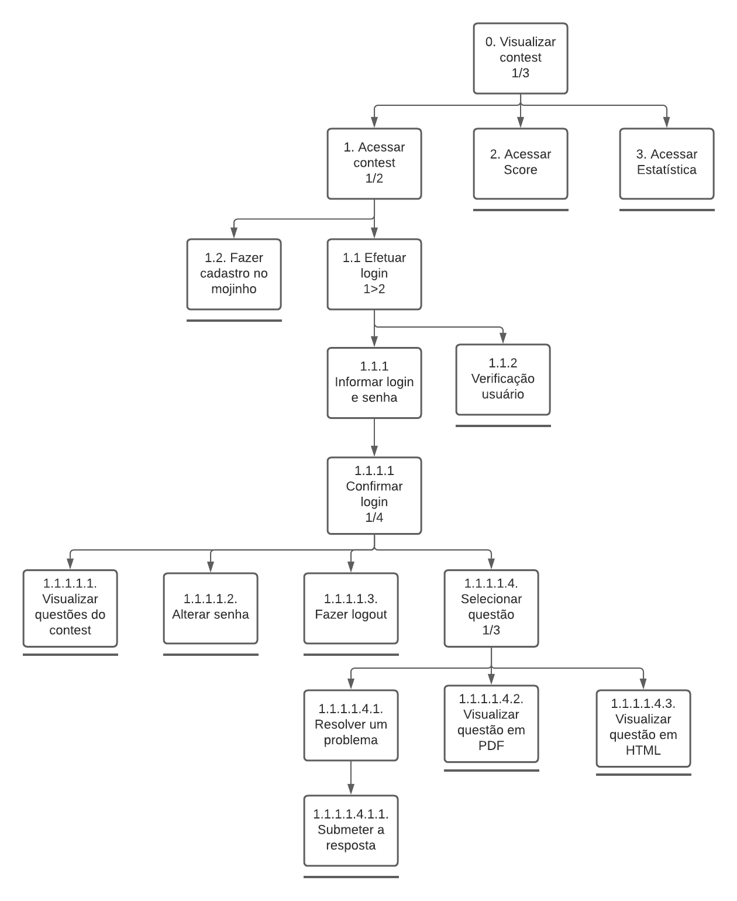
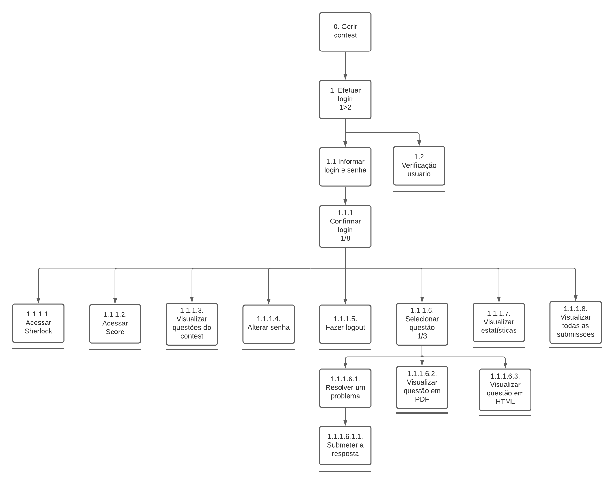

# Análise de Tarefas

## 1. Introdução

Análise de tarefas é a parte de maior foco da área de interação humano computador, pois se preocupa com a performance do trabalho, e isso é o que a distingue de outras técnicas. Uma abordagem sistemática é adotada para descrever as propriedades dos modelos usados na análise de tarefas. Tem como objetivo fornecer ao designer a visão dos usuários em relação as tarefas que eles precisam executar (Diaper e Stanton, 2004).

## 2. Motivo da escolha

Decidimos utilizar esta técnica pois ela fornece uma abordagem genérica para a investigação de problemas de IHC (Annet e Diaper, 2003). E também porque ela facilita a ilustração de tarefas do sistema, separando-as em objetivos, subobjetivos e operações e os relacionando de diferentes maneiras em relação a como as tarefas devem ser executadas pelo usuário, demonstrando as possibilidades de <i>inputs</i>, ações, <i>feedback</i> e problemas que estão no contexto da ferramenta análisada. 

## 3. Análise Hierárquica de Tarefas (HTA)

A Análise Hierárquica de Tarefas (HTA – Hierarchical Task Analysis) foi desenvolvida para entender as competências e habilidades exibidas em tarefas complexas e não repetitivas, e também para auxiliar na identificação de problemas de desempenho. Ela ajuda em relacionar o que as pessoas fazem, por que o fazem, e quais os efeitos caso não o façam corretamente (Barbosa e Silva, 2010).

### 3.1 Diagrama HTA para realizar contest como aluno

[Link para a imagem](https://drive.google.com/file/d/1D3by97Q26qjwLTQ1bDk3wJxA5yoi6BLn/view?usp=sharing)

### 3.2 Representação de Tarefas para o objetivo de realizar contest como aluno

|Objetivo/Operações|Problemas e Recomendações|
|-|-|
| 0. Visualizar *contests* 1/3 | **ação**: Selecionar entre presentes, passados e vindouros   **plano**: Participar de um *contest* e resolver os problemas |
| 1. Acessar *contest* 1/2 | **ação**: Clicar no *contest* desejado   **plano**: Acessar o *contest* desejado |
| 1.1. Efetuar *Login* 1/2 | **plano**: Visualizar questões do *contest* |
| 1.1.1. Verificação usuário| **feedback**: O sistema informa se a senha está incorreta |
| 1.1.2. Informar *login* e senha | **input**: Fornecer *login* e senha |
| 1.1.2.1. Confirmar *login* 1/4 | **ação**: Clicar no botão de *login* |
| 1.1.2.1.1. Visualizar questões do *contest* | **plano**: Visualizar questões do *contest* |
| 1.1.2.1.2. Alterar senha | **feedback**: O sistema informará se é possível alterar a senha   **input**: A nova senha   **ação**: Clicar no botão de mudar a senha |
| 1.1.2.1.3. Fazer *logout* | **ação**: Sair do *contest* atual |
| 1.1.2.1.4. Selecionar questão 1/3 | **plano**: Escolher uma questão para resolver ou visualizar |
| 1.1.2.1.4.1. Resolver um problema | **ação**: Pensar numa solução para o problema  |
| 1.1.2.1.4.1.1. Submeter a resposta | **ação**: Clicar no botão e selecionar um arquivo   **feedback**: O sistema irá informar o veredito da submissão |
| 1.1.2.1.4.2. Visualizar questão em PDF | **ação**: Abrir descrição da questão em um documento PDF |
| 1.1.2.1.4.3. Visualizar questão em HTML | **ação**: Abrir descrição da questão em um documento HTML  |
| 1.2. Fazer cadastro no mojinho | **ação**: Fazer cadastro do usuário por meio do chatbot mojinho |
| 2. Acessar *score* | **plano**: Visualizar quais questões os participantes já enviaram e/ou acertaram|
| 3. Acessar estatística | **plano**: Visualizar os dados estatísticos acerca das questões   **feedback**: O sistema informará se a estatística está disponivel |

### 3.3 Diagrama HTA para gerenciar contest como professor

[Link para a imagem](https://drive.google.com/file/d/14seE0yRKw8f-yGqRkEKR9H-whrxnGX3R/view?usp=sharing)

### 3.4 Representação de Tarefas para o objetivo de gerenciar contest como professor

|Objetivo/Operações|Problemas e Recomendações|
|-|-|
| 0. Efetuar *login*| **plano**: Efetuar *login* e senha |
| 1. Informar *login* e senha| **input**: Fornecer *login* e senha |
| 2. Confirmar *login* 1/8 |  **ação**: Clicar no botão de *login* |
| 2.1. Acessar *Sherlock* | **plano**: Descobrir as submissões suspeitas de plágio   **feedback**:  O sistema informa os códigos que suspeitos de plágio |
| 2.2. Acessar *Score* | **plano**: Mostrar quais questões foram enviadas pelos participantes do *contest* |
| 2.3. Visualizar questões do *contest* | **plano**: Visualizar as questões do *contest* |
| 2.4. Alterar Senha | **feedback**: O sistema informará se é possível alterar a senha.   **problema**: O sistema não permite que a senha seja alterada.|
| 2.5. Fazer *logout* | **ação**: Sair do *contest* atual |
| 2.6. Selecionar questão 1/3 | **plano**: Selecionar uma questão para resolver |
| 2.6.1. Resolver um problema | **ação**: Criar uma solução para o problema proposto |
| 2.6.1.1. Submeter a resposta | **ação**: Clicar no *select* para escolher a questão e submeter o *script*/código com a possível solução da questão |
| 2.6.2. Visualizar questão em PDF | **ação**: Mostrar questão em formato *PDF*.|
| 2.6.3 Visualizar questão em HTML | **ação**: Mostrar questão em formato *HTML*. |
| 2.7. Visualizar estatísticas | **plano**: Visualizar os dados estatísticos acerca das questões   **feedback**: O sistema informará se a estatística está disponivel |
| 2.8. Visualizar todas as submissões | **ação**: Mostrar todos os exercícios enviados por cada aluno. |

## 4. Referências Bibliográficas

- BARBOSA, Simone; SILVA, Bruno. "Interação Humano-Computador". Elsevier Editora Ltda, 2010.
- DIAPER, Dan; STANTON, Neville. "The handbook of task analysis for human-computer interaction". Mahwah, NJ: Lawrence Erlbaum Associates, 2004.

## Versionamento
| Versão | Data | Modificação | Autor |
|--|--|--|--|
| 1.0 | 03/10/2020 | Criação documento de análise de tarefas | Todos os integrantes |
| 1.1 | 03/10/2020 | Ajustes gerais ao documento de análise de tarefas | Todos os integrantes |
| 1.2 | 03/10/2020 | Atualização dos links das imagens do documento de análise de tarefas | Thiago Lopes |
| 1.3 | 03/10/2020 | Correção gerais nos textos e diagramas | Igor Paiva |
