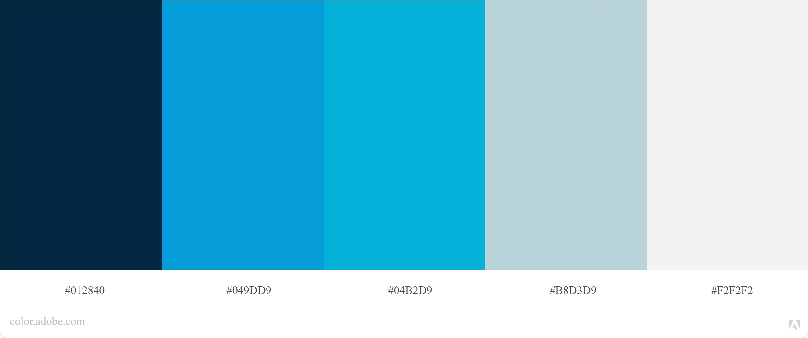

# Metas de usabilidade

## Introdução

O guia de estilo tem como objetivo ser um guia para a equipe de design e de desenvolvedores, de forma as equipes ter uma orientação no momento de criação da interface do sistema, de forma a manter um padrão no design do sistema (Barbosa e Silva, 2010).

A partir disso, os protótipos do CD-MOJ utilizaram como guia para a criação da interface este documento que contém a maioria dos padrões da proposta de uma nova interface do CD-MOJ.

## Cores

As cores escolhidas foram avaliadas em relação a acessibilidade para pessoas com os tipos mais comuns de daltonismo.

As cores escolhidas foram as seguintes:

<a href="https://drive.google.com/file/d/1bw0B7BmXt0gUnuurVSdCDroVhdmAO-NF/view?usp=sharing" target="_blank">Link para a imagem</a>

## Tipografia

A fonte que será utilizada ao longo do projeto será a <a href="https://fonts.google.com/specimen/Roboto+Slab#standard-styles" target="_blank">Roboto Slab</a>, projetada por Christian Robertson.

Exemplos:

<a href="https://drive.google.com/file/d/1yIb9NlQsHFwIDzKP2aUcbMG4EKajaoQe/view?usp=sharing" target="_blank">Link para a imagem</a>

## Referências Bibliográficas

- BARBOSA, Simone; SILVA, Bruno. "Interação Humano-Computador". Elsevier Editora Ltda, 2010.
- Adobe Color, disponível em: https://color.adobe.com/pt/create/color-wheel Acesso em: 11/10/2020
- Google Fonts, disponível em: https://fonts.google.com/ Acesso em: 11/10/2020

## Versionamento
| Versão | Data | Modificação | Autor |
|--|--|--|--|
| 1.0 | 11/10/2020 | Criação do documento de guia de estilo | Todos os integrantes |
| 1.1 | 12/10/2020 | Correções gramaticais e nos links das imagens | Igor Paiva |
