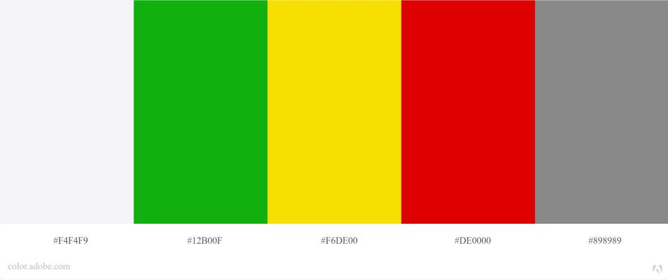

# Metas de usabilidade

## 1. Introdução

### 1.1 Objetivo do Guia de Estilo

O guia de estilo tem como objetivo ser um guia para a equipe de design e de desenvolvedores, de forma que as equipes tenham uma orientação no momento de criação da interface do sistema, mantendo assim um padrão em seu design (Barbosa e Silva, 2010).

A partir disso, os protótipos do CD-MOJ utilizarão este documento, que contém a maioria dos padrões da proposta de uma nova interface do CD-MOJ, como guia para a criação da interface.

### 1.2 Organização e Conteúdo

O guia de estilo segue o padrão sugerido por Marcus e Mayhew sendo separado por seis tópicos.

### 1.3 Público-alvo

Este guia destina-se aos desenvolvedores e projetistas.

### 1.4 Como utilizar esse guia

A cada etapa dentro do ciclo de Mayhew deve-se aplicar o guia de estilo ao projeto.

### 1.5 Como manter o guia

O guia deve ser mantido atualizado após cada alteração e ou decisão acerca das funcionalidades do projeto.

## 2. Resultados de Análise

### 2.1 Descrição do ambiente de trabalho do usuário

O usuário encontra-se num ambiente voltado para a aprendizagem, deve-se prezar pelo foco do usuário ou seja, o usuário não pode se deparar com empecilhos e distrações, também prioriza uma navegação fluída.

## 3. Elementos de interface

### 3.1 Disposição espacial e grid

A disposição espacial do site deve ser responsiva de forma que qualquer usuário consiga utilizar o sistema em dispositivos com resoluções distintas. 

### 3.2 Janela

O sistema não deve contar com muitas janelas dada a simplicidade e o contexto de uso da aplicação.

### 3.3 Tipografia

A fonte que será utilizada ao longo do projeto será a <a class="link" href="https://fonts.google.com/specimen/Roboto+Slab#standard-styles" target="_blank">Roboto Slab</a>, projetada por Christian Robertson.

<a class="link" href="https://drive.google.com/file/d/1yIb9NlQsHFwIDzKP2aUcbMG4EKajaoQe/view?usp=sharing" target="_blank">Link para a imagem</a>

### 3.4 Símbolos não tipográficos

Como atualmente o CD-MOJ não apresenta símbolos não tipográficos, fizemos uma seleção de possíveis símbolos que poderão ser usados levando em conta o contexto de uso da aplicação. Todos esses ícones são do <a href="https://material.io/resources/icons/" target="_blank">Material Icons</a>.

| Ícones | | | | |
|--|--|--|--|--|
|  |  |  |  |  |
|  |  |  |  |  |

### 3.5 Cores

#### 3.5.1 Cores principais

As cores principais escolhidas foram avaliadas em relação à acessibilidade para pessoas com os tipos mais comuns de daltonismo.

As cores principais escolhidas foram as seguintes:

<a class="link" href="https://drive.google.com/file/d/1rV91S2b9LDAsIkeiURHiS4KViya9pQIm/view?usp=sharing" target="_blank">Link para a imagem</a>

#### 3.5.2 Cores secundárias

As cores secundárias foram utilizadas para representação de <i>status</i> de informações do sistema.

As cores secundárias escolhidas foram as seguintes:

<a class="link" href="https://drive.google.com/file/d/16hnPRDOcvgtxOLhso-G04L_BCxxtWhjC/view?usp=sharing" target="_blank">Link para a imagem</a>

### 3.6 Animações

Tendo em vista que o sistema tem um escopo simples, não tem necessidade de animações complexas de mesmo modo, animações simples podem ser utilizadas.

## 4. Elementos de interação

### 4.1 Estilos de interação

O usuário terá a possibilidade de navegação através de botões de icones selecionáveis nos elementos não tipograficos

### 4.2 Seleção de um estilo

Foi escolhido um estilo simples levando em consideração a simplicidade do escopo do sistema.

### 4.3 Aceleradores

Levando em consideração o contexto da aplicação e suas funções, não há necessidade de possuir aceleradores.

## 5. Elementos de ação

### 5.1 Preenchimento de campos

O campo de login é o único campo presente no sistema e deve ser preenchido pelo próprio usuário.

### 5.2 Seleção

O usuário pode selecionar qualquer texto ou elemento no site.

### 5.3 Ativação

A questão da ativação no sistema será direcionada a partir de fundamentos de usabilidade, possibilitando a liberdade do usuário quando dentro do <i>site</i>. 

## 6. Vocabulários e padrões

### 6.1 Terminologia

O site faz uso de uma terminologia utilizada também no contexto de competições de programação, deve-se prezar também pelo ensinamento dos termos para novos usuários.

### 6.2 Tipos de Tela

As telas se diferenciam em: tela de listagem dos contests, tela principal do contest, tela do ranqueamento, tela de visualização das questões, sendo esta bem mais informativa que as outras, tela de estatísticas.

### 6.3 Sequências de diálogos

Deve existir uma confirmação quando o usuário fizer login e também quando ocorrer algum erro nesse processo.

## Referências Bibliográficas

- BARBOSA, Simone; SILVA, Bruno. "Interação Humano-Computador". Elsevier Editora Ltda, 2010.
- Adobe Color, disponível em: https://color.adobe.com/pt/create/color-wheel Acesso em: 11/10/2020
- Google Fonts, disponível em: https://fonts.google.com/ Acesso em: 11/10/2020

## Versionamento
| Versão | Data | Modificação | Autor |
|--|--|--|--|
| 1.0 | 11/10/2020 | Criação do documento de guia de estilo | Todos os integrantes |
| 1.1 | 12/10/2020 | Correções gramaticais e nos links das imagens | Igor Paiva |
| 2.0 | 15/10/2020 | Refatorando estrutura geral do projeto | Marcelo Victor, Rhuan Carlos, Thiago Lopes e Thiago Guilherme |
| 3.0 | 06/12/2020 | Atualizando guia de estilo | Igor Paiva e Thiago Lopes |
