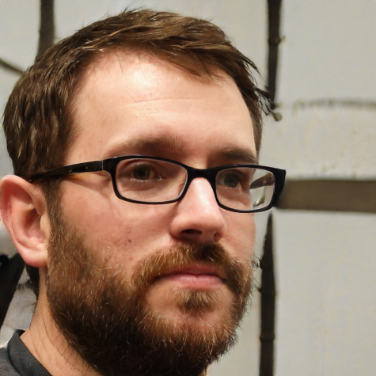

# Perfil de usuário

## Personas

Uma persona é um personagem fictício, arquétipo hipotético de um grupo de usuários reais, criada para descrever um usuário típico, é utilizada principalmente para representar um grupo de usuários finais durante discussões de design, mantendo todos focados no mesmo alvo.

Elas serão utilizadas posteriormente na etapa de elicitação de requisitos pelo método da introspecção.

### Persona 1
| Persona | Breno Carvalho Pinto |
|--|--|
| Status: | Persona Secundária |
| Nome: | Breno Carvalho Pinto |
| Foto: |  |
| Idade: | 19 |
| Profissão: | Estudante, não trabalha ainda por falta de experiência na área |
| Escolaridade: | Cursando Engenharia Mecânica |
| Objetivos: | Concluir a graduação, tornar-se especialista em refrigeração, não perder tempo |
| Habilidades: | Digitar com os olhos fechados, sabe tocar flauta doce, competitividade e trabalho em equipe |
| Relacionamentos: | Solteiro, por enquanto... |
| Requisitos: | Dormir 9 horas por dia |
| Tarefas: | Resolver as listas de exercícios, tirar dúvidas sobre os exercícios, visualizar o gabarito dos exercícios |
| Expectativas: | Espera que o sitema seja de fácil aprendizado, seja agradável aos olhos  |

### Persona 2
| Persona | Samuel Correia Castro |
|--|--|
| Status: | Persona Primária |
| Nome: | Samuel Correia Castro |
| Foto: |  |
| Idade: | 40 |
| Profissão: | Professor |
| Escolaridade: | Doutor em Ciência da Computação |
| Objetivos: | Disseminar o conhecimento sobre a área de computação, ser um grande Youtuber de sucesso |
| Habilidades: | Exímio programador, escreve código ao contrário, toca ocarina, persuasão, motivador e autoconfiança |
| Relacionamentos: | Alunos, professores, familiares, esposa e filhos| 
| Requisitos: | Receber e corrigir atividades de seus alunos  |
| Tarefas: | Preparar e ministrar aulas, e aproveitar o tempo livre com sua família  |
| Expectativas: | Acredita que o sistema é uma forma eficiente, prática e justa de avaliar seus alunos |

### Persona 3

| Persona | Lara Silva de Oliveira |
|--|--|
| Status: | Persona Secundária |
| Nome: | Lara Silva de Oliveira |
| Foto: |  |
| Idade: | 21 |
| Profissão: | Estágio em desenvolvimento de aplicativos na empresa SoftLife |
| Escolaridade: | Ensino Medio completo e cursando o 7º semestre de Engenharia da Computação |
| Objetivos: | Conseguir uma bolsa de estudos fora do país e ser professora universitária |
| Habilidades: | Desenvolver sistemas web, montar computadores, projetar sistemas eletrônicos , poliglota ( Inglês, Português, Russo e Alemão ), dança ballet |
| Relacionamentos: | Amigos de curso, familiares, namora a 3 anos e meio com Wellington B. |
| Requisitos: | Orientação do professor para atuar como monitora, acesso ao site com privilégios de monitora |
| Tarefas: | Auxiliar os alunos com as possíveis dúvidas em relação ao conteúdo que está sendo ministrado. |
| Expectativas: | Visualizar as questões das listas disponiveis, ter acesso ao código dos alunos |

### Persona 4
| Persona | Maria Julia Jesus |
|--|--|
| Status: | Antiusuário |
| Nome: | Maria Julia Jesus |
| Foto: |  |
| Idade: | 63 |
| Profissão: | Aposentada, dava aulas de português no colégio Vetorial para o ensino médio |
| Escolaridade: | Ensino Superior e licenciatura em letras |
| Objetivos: | Fazer as viagens que sempre sonhou, manter uma boa relação com sua filha |
| Habilidades: | Sabe cozinhar diversos doces, crochê e tocar piano |
| Relacionamentos: | Avó de 2 netos, e convive com sua filha |
| Requisitos: | Ter uma vida feliz enquanto vive junto a sua família |
| Tarefas: | Terminar seu tapete de sala, cozinhar torta para seus netos e mandar bom dia para o grupo da família |
| Expectativas: | Gosta de estudar diversas áreas, porém não tem interesse na área de TI |

## Referências Bibliográficas

- BARBOSA, Simone. SILVA Bruno. "Interação Humano-Computador"

## Versionamento

| Versão | Data       | Modificação                   | Autor                |
| ------ | ---------- | ----------------------------- | -------------------- |
| 1.0    | 30/09/2020 | Criação documento de personas | Todos os integrantes |
| 1.1    | 03/10/2020 | Correções nos links das imagens | Marcelo Victor |
| 1.2    | 03/10/2020 | Tirando dados redundantes     | Thiago Guilherme     |
