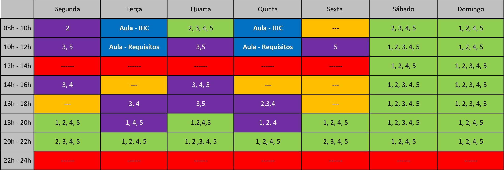
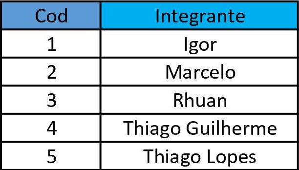
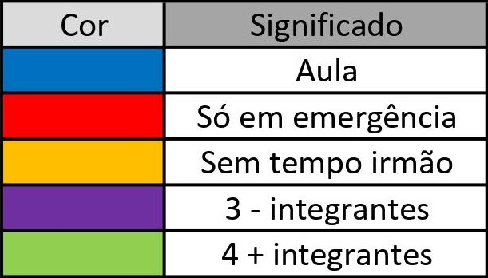

# Planejamento

## 1. Introdução

&nbsp;&nbsp;Este documento apresenta o planejamento do projeto, descreveremos aqui as etapas de desenvolvimento. Será dividido em cinco partes: introdução, cronogramas, metodologia, equipe, ferramentas utilizadas e referência bibliográfica.

## 2. Listas de sites avaliados

- CD-MOJ
- MPU
- SIGAA
- UVA OJ
- Auxílio emergencial

## 3. Cronogramas

&nbsp;&nbsp;Tendo em vista os prazos estipulados pela disciplina, a equipe organizou um planejamento inicial de modo a atender às exigências de cada ponto de controle. É importante destacar que as datas podem ser alteradas futuramente

### 3.1 Etapas

|Entrega|Descrição|    Data     |
|:--------:|:-----------------------------:|:-------:|
|I| Planejamento do projeto e Processo de Design| 01/09 à 21/09 |
|II| Perfil do usuário, personas e análise de tarefas| 22/09 à 05/10 |
|III| Príncipios gerais de projeto, metas de usabilidade e guias de estilo | 06/10 à 05/10 |
|IV| Planejamento da avaliação, relato dos resultados da avaliação do storyboard e relato das análises da tarefa | 16/10 à 29/10 |
|V| Planejamento da avaliação, relato dos resultados da avaliação do storyboard e protótipo do papel | 30/10 à 12/11 |
|VI| Planejamento da avaliação e relato dos resultados da avaliação do protótipo de alta fidelidade |13/11 à 01/12 |

## 4. Metodologia:

###  eXtreme Programming (XP):

&nbsp;&nbsp;É uma metodologia leve para times de tamanho pequeno e médio que utiliza quatro valores (comunicação, simplicidade, feedback e coragem). Será adotado o pareamento entre os membros da equipe, vizando homogeneização do conhecimento.

###  Rolagem de dados:

&nbsp;&nbsp;É uma metodologia de autoria nossa para otimizar e agilizar o tempo de divisão das tarefas entre os integrantes. Sempre que surgir a necessidade de decidir de forma rápida quem irá realizar uma determinada tarefa, rolam-se os dados e decide-se quem irá fazer a tarefa.

## 5. Equipe

### Horários disponíveis dos integrantes

&nbsp;&nbsp;A tabela abaixo representa os horários disponiveis do integrantes do grupo, com intuito de gerenciar pareamentos e reuniões presenciais ou por videoconferência (utilizando o Google Hangouts)

 
  
  

    
    
  

Tabela horários disponível [**aqui**](https://unbbr-my.sharepoint.com/:x:/g/personal/180018728_aluno_unb_br/EQdxh2LVMcBFisw_7OY68R0BNMp7wD1DMw01AS471TkVoQ?e=XIeJQP)
 

## 6. Ferramentas Utilizadas

| Ferramenta | Nome | Descrição |
|:--:|:--:|:--:|
|  | [Discord](https://discordapp.com) | Plataforma de comunicação para chamadas de áudio e vídeo |
|  | [Google Docs](https://docs.google.com) | Ferramenta para criação de documentos |
|  | [GitHub](https://github.com) | Plataforma de versionamento em que iremos armazenar todos os arquivos relacionados ao projeto |
|  | [Lucidchart](www.lucidchart.com) | Ferramenta CASE |
|  | [Office 365](www.office.com) | Versão online do Microsoft Office 365 |
|  | [Overleaf](https://docs.google.com) | Ferramenta para criação de documentos |
|  | [Telegram](https://web.telegram.org) | Ferramenta de comunicação rápida entre os integrantes |
|  | [ZenHub](https://www.zenhub.com) | Subsistema no GitHub que permite gestão ágil do projeto/grupo com interface KanBan |

## 7. Referências Bibliográficas

- Integrando XP as principais metodologias ágeis, disponível em: https://www.devmedia.com.br/integrando-xp-as-principais-metodologias-ageis/30989
- BARBOSA, Simone. SILVA Bruno. "Interação Humano-Computador"

## Versionamento
| Versão | Data | Modificação | Autor |
|--|--|--|--|
| 1.0 | 16/09/2020 | Criação documento de planejamento | Todos os integrantes |
